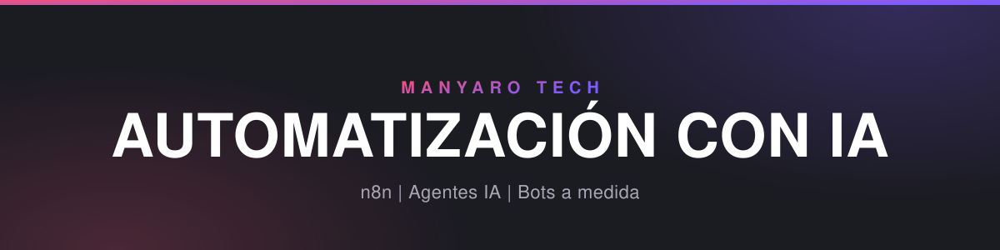
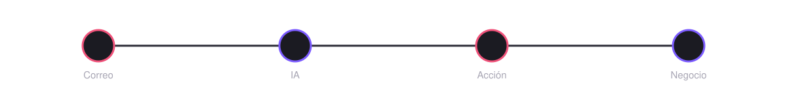

  

  

  
  

  Automatizamos negocios locales con IA: bots, flujos, páginas web y dashboards a medida, 
  construidos para que los use cualquier persona del equipo, sin depender de nosotros.

  

 

<table align="center">
<tr>
<td width="25%" valign="top">

 **Flujos con IA**

Clasificación, redacción y automatización de tareas repetitivas sobre n8n.

</td>
<td width="25%" valign="top">

 **Bots a medida**

Correo, WhatsApp, Telegram, voz — siempre con una persona revisando antes de enviar.

</td>
<td width="25%" valign="top">

 **Integraciones**

CRMs, calendarios, facturación: lo que ya use cada negocio, sin migraciones forzadas.

</td>
<td width="25%" valign="top">

 **Dominios y páginas web**

Registro y gestión de dominios, y creación de páginas web para negocios locales.

</td>
</tr>
<tr>
<td width="25%" valign="top">

 **Gestión de correo**

Bandejas de entrada organizadas con IA: clasificación automática y borradores de respuesta.

</td>
<td width="25%" valign="top">

 **Dashboards a medida**

Paneles personalizados para que cada negocio vea sus datos importantes de un vistazo.

</td>
<td width="25%" valign="top">

 **Automatizaciones para empresas**

Automatizaciones a medida que ahorran tiempo del equipo y aumentan el beneficio.

</td>
<td width="25%" valign="top">

 **¿Hablamos?**

</td>
</tr>
</table>

 

STACK CON EL QUE CONSTRUIMOS

  
  
  
  
  

CON QUÉ TRABAJAMOS

  
  
  
  
  
  
  
  

© 2026 ManYaro Tech. Hecho en España.

